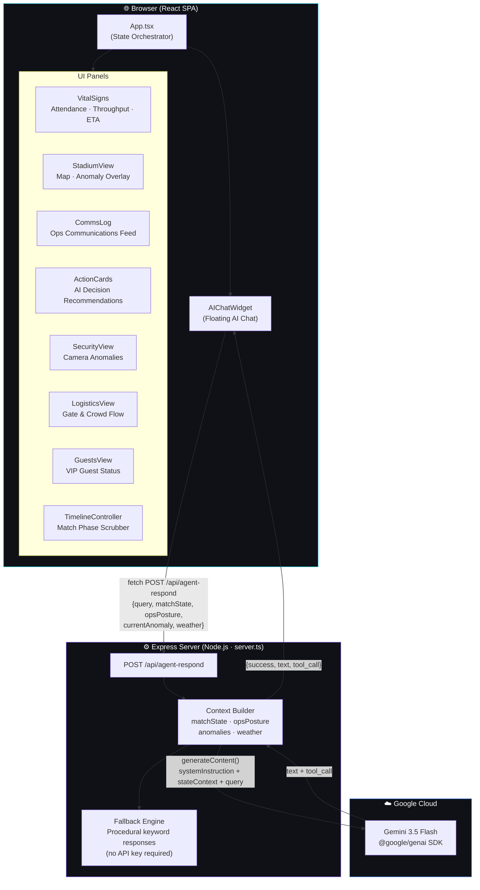
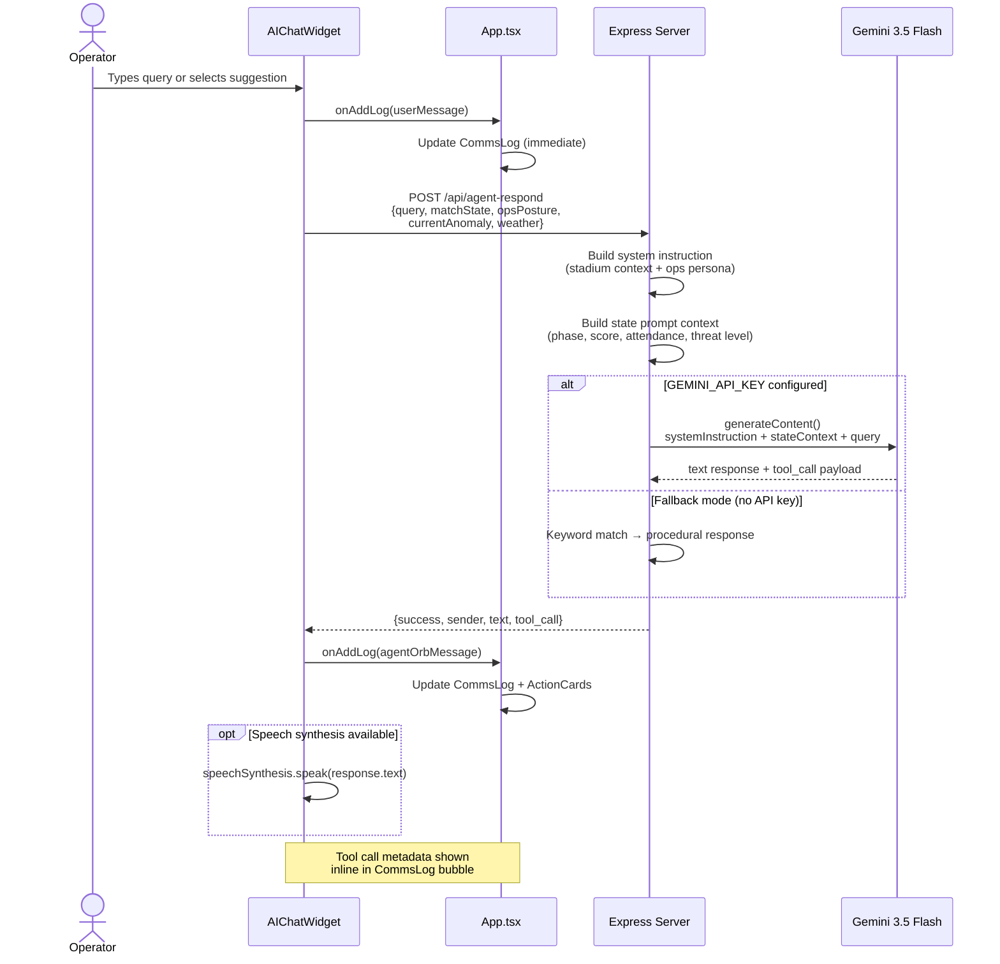

<div align="center">

# 🏏 CricSentinel

### AI-Powered Stadium Operations Command Center

**Real-time crowd intelligence, incident management, and AI-guided decision support for large-scale cricket events**

[](https://react.dev)
[](https://www.typescriptlang.org)
[](https://vitejs.dev)
[](https://tailwindcss.com)
[](https://ai.google.dev)
[](./LICENSE)

*Built for the IPL 2026 Finale · Narendra Modi Stadium, Ahmedabad · 130,000 seats*

</div>

---

## What is CricSentinel?

CricSentinel is a **stadium operations command center** that gives ops teams a single pane of glass for managing a packed cricket stadium. It combines real-time telemetry (attendance, gate throughput, egress ETA), anomaly detection (crowd surges, security alerts), and an embedded AI agent — **@Agent_Orb** — powered by Google Gemini that answers operator queries, suggests decisions, and generates runbook steps on the fly.

Think: mission control, but for a cricket finale with 130,000 fans.

---

## Architecture



---

## Agent Interaction Flow



---

## Features

| Feature | Description |
|---|---|
| **Real-time Vitals** | Live attendance, gate throughput, and egress ETA across match phases |
| **Stadium Map** | Visual anomaly overlay showing active security or crowd incidents by section |
| **@Agent_Orb AI** | Gemini-powered ops AI with match-phase-aware context and smart suggestions |
| **Incident Runbooks** | Step-by-step runbook generation for anomaly response |
| **Comms Log** | Timestamped communications feed with agent and operator entries |
| **Decision Cards** | AI-generated action recommendations per match phase |
| **Timeline Replay** | Scrub through match phases (Pre-Match → Powerplay → Death → Super Over) |
| **Graceful Fallback** | Full app functionality without a Gemini API key via procedural AI responses |
| **Dark / Light Theme** | Persistent theme toggle with glass morphism UI |

---

## Tech Stack

| Layer | Technology |
|---|---|
| Frontend | React 19, TypeScript 5.8, Vite 6 |
| Styling | Tailwind CSS v4, custom glass morphism theme |
| Animation | Motion (Framer Motion) |
| Backend | Express 4, Node.js |
| AI | Google Gemini 3.5 Flash (`@google/genai`) |
| Build | Vite (SPA) + esbuild (server bundle) |
| Deploy | Google Cloud Run |

---

## Quick Start

**Prerequisites:** Node.js 18+

```bash
# 1. Install dependencies
npm install

# 2. Configure your Gemini API key
cp .env.example .env.local
# Edit .env.local and set GEMINI_API_KEY=your_key_here

# 3. Start the dev server
npm run dev
# → http://localhost:3000
```

> **No API key?** The app works in fallback mode with built-in procedural responses. Great for demos.

---

## Deploy to Cloud Run

```bash
# 1. Build
npm run build

# 2. Create a Dockerfile (or use Cloud Run source deploy)
gcloud run deploy cricsentinel \
  --source . \
  --region us-central1 \
  --set-env-vars GEMINI_API_KEY=your_key \
  --allow-unauthenticated
```

---

## Project Structure

```
cricsentinel/
├── src/
│   ├── App.tsx                 # Root component & state orchestrator
│   ├── types.ts                # Domain types (MatchState, Anomaly, CommsEntry…)
│   ├── mockTimeline.ts         # Match phase replay data
│   ├── index.css               # Tailwind v4 + custom theme tokens
│   └── components/
│       ├── AIChatWidget.tsx    # Floating AI chat interface
│       ├── ActionCards.tsx     # Decision recommendation cards
│       ├── CommsLog.tsx        # Operations communications feed
│       ├── GuestsView.tsx      # VIP guest management
│       ├── LogisticsView.tsx   # Gate & crowd flow
│       ├── SecurityView.tsx    # Camera anomaly alerts
│       ├── StadiumView.tsx     # Stadium map + anomaly overlay
│       ├── TimelineController.tsx # Match phase scrubber
│       └── VitalSigns.tsx      # Telemetry strip
├── server.ts                   # Express server + Gemini API handler
├── vite.config.ts
├── tsconfig.json
└── metadata.json               # AI Studio metadata
```

---

## Environment Variables

| Variable | Required | Description |
|---|---|---|
| `GEMINI_API_KEY` | No* | Google Generative AI key. Missing → graceful fallback. |
| `NODE_ENV` | No | Set to `production` to serve built `dist/` statically |
| `DISABLE_HMR` | No | Set `true` to disable HMR (AI Studio workflow) |
| `GCP_PROJECT_ID` | No | GCP project for Vertex AI regional routing |
| `GCP_LOCATION` | No | GCP region (e.g. `us-central1`) |

*App runs in demo mode without it.

---

## Scripts

```bash
npm run dev     # Dev server with HMR
npm run build   # Production build (Vite SPA + esbuild server)
npm run start   # Run bundled production server
npm run lint    # TypeScript type check
npm run clean   # Remove dist/
```

---

## Contributing

See [CONTRIBUTING.md](./CONTRIBUTING.md).

---

<div align="center">
Built with ❤️ for IPL 2026 · Powered by Google Gemini · Made to keep 130,000 fans safe
</div>
