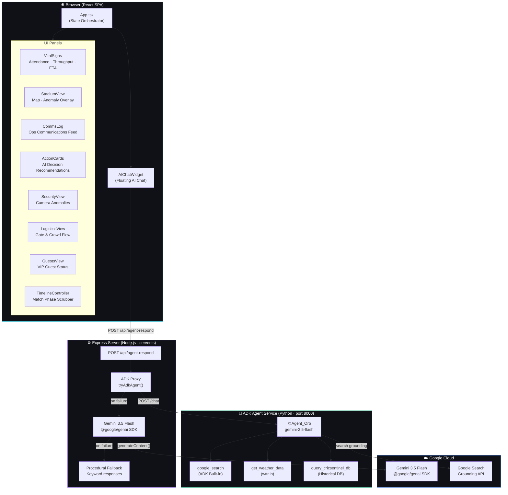
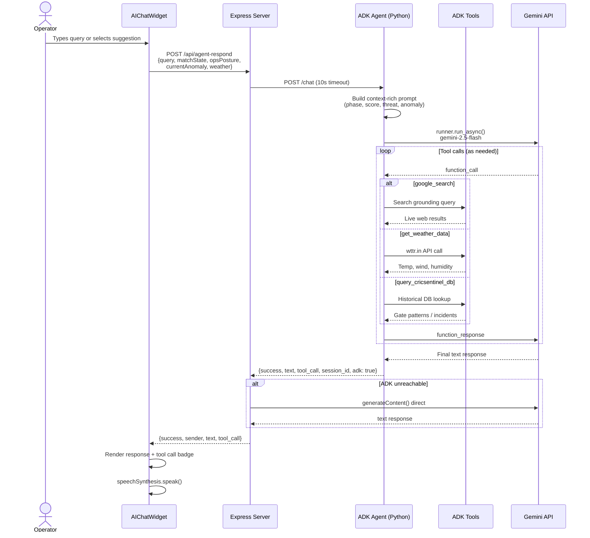

<div align="center">

# 🏏 CricSentinel

### AI-Powered Stadium Operations Command Center

**Real-time crowd intelligence, incident management, and AI-guided decision support for large-scale cricket events**

[](https://react.dev)
[](https://www.typescriptlang.org)
[](https://vitejs.dev)
[](https://tailwindcss.com)
[](https://google.github.io/adk-docs/)
[_·_3.5_Flash_(API)-4285F4?logo=google&logoColor=white)](https://ai.google.dev)
[](./LICENSE)

*Built for the IPL 2026 Finale · Narendra Modi Stadium, Ahmedabad · 130,000 seats*

**🌐 Live Demo → [cric-sentinel-593919045544.us-west1.run.app](https://cric-sentinel-593919045544.us-west1.run.app)**

</div>

---

## ☁️ Google Cloud & AI Services

> This project is built entirely on Google Cloud infrastructure and Google AI APIs — a first-class GCP stack from model to deployment.

| Service | Role |
|---|---|
| **[Google Agent Development Kit (ADK)](https://google.github.io/adk-docs/)** — `google-adk` | Primary AI agent framework. Powers the @Agent_Orb Python agent with multi-tool reasoning, session memory, and built-in Google Search grounding |
| **[Google Gemini 2.5 Flash](https://ai.google.dev/gemini-api/docs)** — ADK agent model | Drives the ADK agent's reasoning, tool selection, and natural-language ops guidance |
| **[Google Gemini 3.5 Flash](https://ai.google.dev/gemini-api/docs)** — `@google/genai` SDK | Direct API fallback layer — used when the ADK service is unreachable |
| **[Google Cloud Run](https://cloud.google.com/run)** | Serverless container hosting. Zero-config auto-scaling, HTTPS by default, deployed in `us-west1` |
| **[Google Cloud Build](https://cloud.google.com/build)** | CI/CD pipeline. Builds the multi-stage Docker image and pushes to Artifact Registry on every deploy |
| **[Google Artifact Registry](https://cloud.google.com/artifact-registry)** | Private Docker image registry (`us-west1`) storing versioned container images |
| **[Google Secret Manager](https://cloud.google.com/secret-manager)** | Secure storage for `GEMINI_API_KEY` — injected at runtime via Cloud Run secret binding, never baked into the image |

---

## 🤖 Google ADK Agent — @Agent_Orb

@Agent_Orb is built on **[Google's Agent Development Kit (ADK)](https://google.github.io/adk-docs/)** — Google's open-source Python framework for building production-grade AI agents. The ADK handles multi-turn session memory, automatic tool selection, and structured tool call/response routing, so the agent can chain multiple tools in a single operator query.

### Agent Architecture

```
cricsentinel-orb/
└── app/
    ├── agent.py      # ADK Agent definition — model, instruction, tools
    ├── tools.py      # Three registered function tools
    └── server.py     # FastAPI wrapper exposing POST /chat
```

The agent runs as a standalone Python microservice (port 8000). The Express server proxies requests to it; if unavailable, it falls through to direct Gemini API, then a procedural fallback — so the app is always live.

### ADK Built-in Tools

| Tool | Type | What it does |
|---|---|---|
| **`google_search`** | ADK Built-in (`google_search_tool`) | Grounds responses in live Google Search results — IPL news, squad updates, real-time context |
| **`get_weather_data`** | Custom `FunctionTool` | Fetches real-time weather for Ahmedabad via wttr.in (temp, humidity, wind, visibility) |
| **`query_cricsentinel_db`** | Custom `FunctionTool` | Queries the CricSentinel historical operations database — gate patterns, incident history, capacity zones, egress benchmarks across IPL 2019–2025 |

### `google_search` — ADK Grounding Tool

The `google_search` built-in is sourced from `google.adk.tools.google_search_tool` and uses Gemini's native Search Grounding capability. When the operator asks about live IPL news, squad changes, or anything beyond the local dataset, the agent automatically invokes this tool and cites sources inline.

```python
from google.adk.tools.google_search_tool import google_search

root_agent = Agent(
    name="cricsentinel_orb",
    model="gemini-2.5-flash",
    tools=[google_search, ...],
)
```

### CricSentinel Historical Database

The `query_cricsentinel_db` tool exposes a structured dataset covering Narendra Modi Stadium operations history:

| `query_type` | Data |
|---|---|
| `attendance_history` | IPL Finale crowd figures 2019–2025 with peak ingress phase notes |
| `incident_history` | Security anomalies, bottlenecks, medical, weather holds — with resolutions |
| `gate_patterns` | Per-gate fan/min throughput benchmarks by match phase (pre_match → done) |
| `capacity_zones` | Gate-to-section mapping, max capacity per zone, medical station locations |
| `egress_benchmarks` | Historical egress ETA by scenario (normal, super over, rain hold, emergency) |

Supports `filters` parameter (e.g. `"phase:innings_break"`, `"year:2025"`) for targeted lookups.

### 3-Tier Fallback Chain

```
Operator Query
     │
     ▼
┌─────────────────────────────────┐
│  1. ADK Python Agent (port 8000) │  ← gemini-2.5-flash + 3 tools
│     google_search                │
│     get_weather_data             │
│     query_cricsentinel_db        │
└──────────────┬──────────────────┘
               │ (if unreachable)
               ▼
┌─────────────────────────────────┐
│  2. Direct Gemini 3.5 Flash      │  ← @google/genai SDK
│     generateContent()            │
└──────────────┬──────────────────┘
               │ (if API key missing)
               ▼
┌─────────────────────────────────┐
│  3. Procedural Keyword Fallback  │  ← always works, no key needed
└─────────────────────────────────┘
```

---

## What is CricSentinel?

CricSentinel is a **stadium operations command center** that gives ops teams a single pane of glass for managing a packed cricket stadium. It combines real-time telemetry (attendance, gate throughput, egress ETA), anomaly detection (crowd surges, security alerts), and an embedded AI agent — **@Agent_Orb** — that answers operator queries, suggests decisions, and generates runbook steps on the fly.

Think: mission control, but for a cricket finale with 130,000 fans.

---

## Architecture



---

## Agent Interaction Flow



---

## Features

| Feature | Description |
|---|---|
| **Real-time Vitals** | Live attendance, gate throughput, and egress ETA across match phases |
| **Stadium Map** | Visual anomaly overlay showing active security or crowd incidents by section |
| **@Agent_Orb AI (ADK)** | Google ADK-powered ops agent with real tools — live weather, web search, historical DB |
| **Incident Runbooks** | Step-by-step runbook generation for anomaly response |
| **Comms Log** | Timestamped communications feed with agent and operator entries |
| **Decision Cards** | AI-generated action recommendations per match phase |
| **Timeline Replay** | Scrub through match phases (Pre-Match → Powerplay → Death → Super Over) |
| **3-Tier Fallback** | ADK agent → direct Gemini → procedural — always operational, no single point of failure |
| **Dark / Light Theme** | Persistent theme toggle with glass morphism UI |

---

## Tech Stack

| Layer | Technology |
|---|---|
| Frontend | React 19, TypeScript 5.8, Vite 6 |
| Styling | Tailwind CSS v4, custom glass morphism theme |
| Animation | Motion (Framer Motion) |
| Backend (Node) | Express 4, Node.js — rate-limited REST proxy |
| **AI Agent Framework** | **Google ADK 1.26 (`google-adk`) — Python** |
| Agent Model | Gemini 2.5 Flash (ADK) · Gemini 3.5 Flash (direct fallback) |
| Agent Tools | `google_search` (built-in), `get_weather_data`, `query_cricsentinel_db` |
| Agent Runtime | FastAPI + uvicorn, managed by `uv` |
| Build | Vite (SPA) + esbuild (server bundle) |
| Deploy | Google Cloud Run |

---

## Quick Start

**Prerequisites:** Node.js 18+, Python 3.11+, [uv](https://docs.astral.sh/uv/)

```bash
# 1. Install Node dependencies
npm install

# 2. Configure your Gemini API key
cp .env.example .env
# Edit .env and set GEMINI_API_KEY=your_key_here
```

**Terminal 1 — Start the ADK Python agent:**

```bash
cd cricsentinel-orb
cp ../.env .env          # share the same API key
./run.sh                 # uv run uvicorn app.server:app --port 8000 --reload
# → ADK agent live at http://localhost:8000
```

**Terminal 2 — Start the Node app:**

```bash
npm run dev
# → http://localhost:3000
```

> **No ADK service?** The app automatically falls back to direct Gemini 3.5 Flash. No API key at all? Procedural responses keep the demo fully functional.

---

## Deploy to Cloud Run

```bash
# 1. Store your API key securely in Secret Manager
echo -n "YOUR_GEMINI_API_KEY" | gcloud secrets create GEMINI_API_KEY --data-file=-

# 2. Build and push image via Cloud Build
gcloud builds submit --tag us-west1-docker.pkg.dev/PROJECT_ID/REPO/cric-sentinel:latest

# 3. Deploy
gcloud run deploy cric-sentinel \
  --image=us-west1-docker.pkg.dev/PROJECT_ID/REPO/cric-sentinel:latest \
  --region=us-west1 \
  --allow-unauthenticated \
  --port=3000 \
  --set-secrets="GEMINI_API_KEY=GEMINI_API_KEY:latest"
```

---

## Project Structure

```
cricsentinel/
├── cricsentinel-orb/           # Google ADK Python agent service
│   ├── app/
│   │   ├── agent.py            # ADK Agent — model, instruction, tools
│   │   ├── tools.py            # get_weather_data, query_cricsentinel_db
│   │   └── server.py           # FastAPI wrapper (POST /chat, GET /health)
│   ├── pyproject.toml          # uv-managed Python deps
│   └── run.sh                  # ./run.sh → starts agent on port 8000
├── src/
│   ├── App.tsx                 # Root component & state orchestrator
│   ├── types.ts                # Domain types (MatchState, Anomaly, CommsEntry…)
│   ├── mockTimeline.ts         # Match phase replay data
│   ├── index.css               # Tailwind v4 + custom theme tokens
│   └── components/
│       ├── AIChatWidget.tsx    # Floating AI chat interface
│       ├── ActionCards.tsx     # Decision recommendation cards
│       ├── CommsLog.tsx        # Operations communications feed
│       ├── GuestsView.tsx      # VIP guest management
│       ├── LogisticsView.tsx   # Gate & crowd flow
│       ├── SecurityView.tsx    # Camera anomaly alerts
│       ├── StadiumView.tsx     # Stadium map + anomaly overlay
│       ├── TimelineController.tsx # Match phase scrubber
│       └── VitalSigns.tsx      # Telemetry strip
├── server.ts                   # Express server + ADK proxy + Gemini fallback
├── Dockerfile                  # Multi-stage container build
├── vite.config.ts
└── tsconfig.json
```

---

## Environment Variables

| Variable | Required | Description |
|---|---|---|
| `GEMINI_API_KEY` | No* | Google Generative AI key. Used by both ADK agent and direct Gemini fallback. |
| `ADK_AGENT_URL` | No | ADK Python service URL. Default: `http://localhost:8000` |
| `NODE_ENV` | No | Set to `production` to serve built `dist/` statically |
| `DISABLE_HMR` | No | Set `true` to disable HMR (AI Studio workflow) |
| `GCP_PROJECT_ID` | No | GCP project for Vertex AI regional routing |
| `GCP_LOCATION` | No | GCP region (e.g. `us-central1`) |

*App runs in demo mode without it.

---

## Scripts

```bash
# Node app
npm run dev     # Dev server with HMR
npm run build   # Production build (Vite SPA + esbuild server)
npm run start   # Run bundled production server
npm run lint    # TypeScript type check

# ADK agent
cd cricsentinel-orb
./run.sh        # Start agent service on port 8000
uv run pytest   # Run agent unit tests
```

---

## Contributing

See [CONTRIBUTING.md](./CONTRIBUTING.md).

---

<div align="center">
Built with ❤️ for IPL 2026 · Powered by Google ADK + Gemini · Made to keep 130,000 fans safe
</div>
